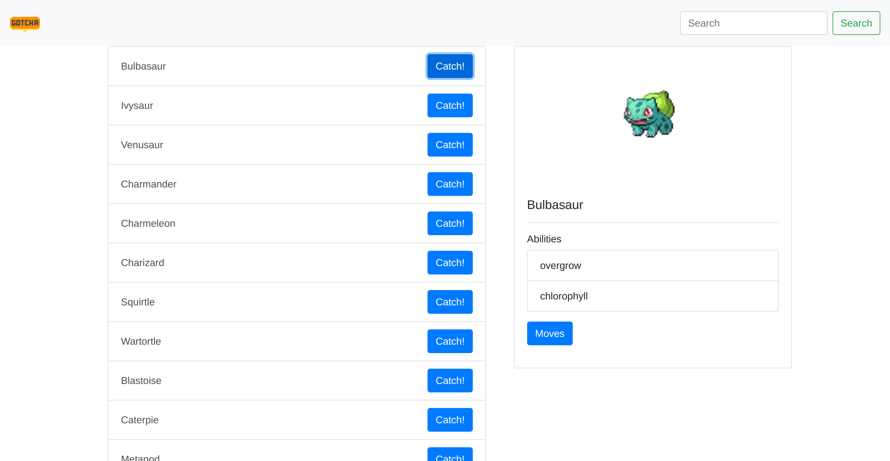

## Run

You can run this app by simply cloning it and running with npm start.
For your convenience app has the ability to run in container.
To run it without the need to install additional deps (like node, npm...) follow the steps:

1. Clone the app
2. cd to app's directory
3. `docker build -t <<your-tag>> .`
4. `docker run -p <desired-port>:8000 -d <your-tag>`
